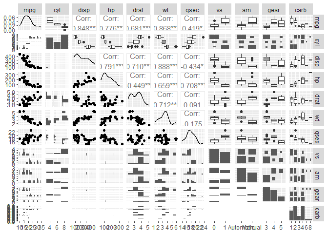
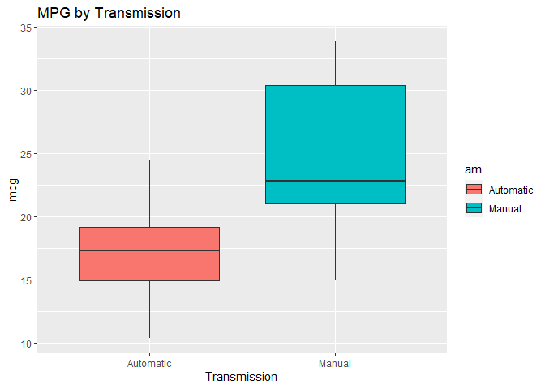
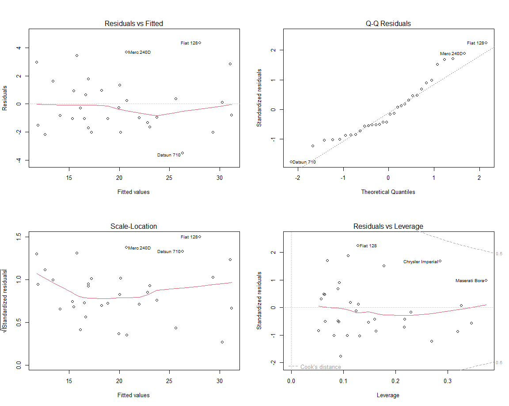

## Problem Specification

This report looks at the mtcars dataset to explore the relationship between a set of variables and fuel autonomy in MPG. The data was extracted from the 1974 Motor Trend US magazine, and comprises fuel consumption and 10 aspects of automobile design and performance for 32 automobiles (1973–74 models). Regression models and exploratory data analyses are used to mainly explore how automatic (am = 0) and manual (am = 1) transmissions features affect the MPG feature.

T-test shows that the performance difference between cars with automatic and manual transmission. And it is about 7 MPG more for cars with manual transmission than those with automatic transmission. Then, several linear regression models are fitted and one with highest Adjusted R-squared value is selected. 

So, given that weight and quarter mile time are held constant, manual transmitted cars are 14.079 + (-4.141)*weight more MPG (miles per gallon) on average better than automatic transmitted cars. Thus, cars that are lighter in weight with a manual transmission and cars that are heavier in weight with an automatic transmission will have higher fuel economy.


## Exploratory Analysis


With Figure 1 its possible to infer that there seems to exist a relationship between fuel economy with “wt”, “disp”, “cyl”, “hp” and "am" (automatic transmission)

Looking in detail to mpg by transmission (Figure 2) it appears to exist a relationship between type of transmission and the fuel economy of a vehicle as seen above

Considering there is a close relationship between weight and transmission (Figure 3) we must include the variable in the model as an interaction term (wt*am)

## Inference

For this step, null hypothesis is made as the MPG of the automatic and manual transmissions are within the same population (assuming the MPG has a normal distribution). Two sample T-tests are used to show it.


```r
result <- t.test(mpg ~ am,df)
result$p.value
```

```
## [1] 0.001373638
```


```r
result$estimate
```

```
## mean in group Automatic    mean in group Manual 
##                17.14737                24.39231
```

Since the p-value is 0.00137, the null hypothesis is rejected. So, automatic and manual transmissions are from different populations. And the mean for MPG of manual transmitted cars is about 7 more than that of automatic transmitted cars.

## Model selection


Starting with a model containing all variables, it has the Residual standard error as 2.833 on 15 degrees of freedom. Adjusted R-squared value is 0.779, so the model can explain about 78% of the variance of the MPG variable. However, none of the coefficients are significant at 0.05 significant level.


```r
sqrt(vif(fit_all))
```

```
##           GVIF       Df GVIF^(1/(2*Df))
## cyl  11.319053 1.414214        1.834225
## disp  7.769536 1.000000        2.787389
## hp    5.312210 1.000000        2.304823
## drat  2.609533 1.000000        1.615405
## wt    4.881683 1.000000        2.209453
## qsec  3.284842 1.000000        1.812413
## vs    2.843970 1.000000        1.686407
## am    3.151269 1.000000        1.775181
## gear  7.131081 1.414214        1.634138
## carb 22.432384 2.236068        1.364858
```

When selecting all variables (except model and manufacturer, which are not relevant in this analysis) we can see high amounts for VIF for most of them, leading to a conclusion we might be inflating standard errors in adding unnecessary or correlated variables.

Next, backward selection is used to select some statistically significant variables.


The model outputted is “mpg ~ wt + qsec + am”. The Residual standard error is 2.459 on 28 degrees of freedom. The Adjusted R-squared value is 0.8336, so the model can explain about 83% of the variance of the MPG variable. All of the coefficients are significant at 0.05 significant level.

In the exploratory step it is shown that there appears to be an interaction term between “wt” variable and “am” variable, since automatic cars are usually heavier than manual cars. 


The new model outputted, addint the interaction term between "am" and "wt" is “mpg ~ wt*am + qsec”. This model has the Residual standard error as 2.084 on 27 degrees of freedom. The Adjusted R-squared value is 0.8804, so the model can explain about 88% of the variance of the MPG variable. All of the coefficients are significant at 0.05 significant level.

For comparison with the step model, a simple model is fitted with "mpg" as the outcome variable and "am" as the predictor.


The model is selected with an analysis of the output of the anova function, which computes an analysis of variance (or deviance) tables for the supplied models.


```r
anova(fit_am,fit_step,fit_wt,fit_all)
```

```
## Analysis of Variance Table
## 
## Model 1: mpg ~ am
## Model 2: mpg ~ wt + qsec + am
## Model 3: mpg ~ wt + am + qsec + wt:am
## Model 4: mpg ~ cyl + disp + hp + drat + wt + qsec + vs + am + gear + carb
##   Res.Df    RSS Df Sum of Sq       F    Pr(>F)    
## 1     30 720.90                                   
## 2     28 169.29  2    551.61 34.3604 2.509e-06 ***
## 3     27 117.28  1     52.01  6.4795    0.0224 *  
## 4     15 120.40 12     -3.13                      
## ---
## Signif. codes:  0 '***' 0.001 '**' 0.01 '*' 0.05 '.' 0.1 ' ' 1
```

Anova shows that adding an interaction between wt and am appears to be necessary over looking at wt and am without interaction. For steps 3 to 4 there seems to be a negative impact in adding all the others variables, as such that the selected mode is number 3, fit_wt.


```r
confint(fit_wt)
```

```
##                  2.5 %    97.5 %
## (Intercept) -2.3807791 21.826884
## wt          -4.3031019 -1.569960
## amManual     7.0308746 21.127981
## qsec         0.4998811  1.534066
## wt:amManual -6.5970316 -1.685721
```
The result shows that when “wt” (weight lb/1000) and “qsec” (quarter mile time) are held constant, cars with manual transmission add 14.079 + (-4.141)*wt more MPG (miles per gallon) on average than cars with automatic transmission. For example, a manual transmitted car that weighs 2000 lbs have 5.8 more MPG than an automatic transmitted car that has both the same weight and quarter mile time. For cars over 3400 lbs the added weight of the automatic transmission shows benefit compared to a car equipped with a manual transmission.

## Residual Analysis

Interpreting Figure 4:

a. The Residuals vs Fitted plot shows no consistent pattern, supporting the accuracy of the independence assumption.

b. The Q-Q Residuals plot indicates that the residuals are normally distributed because the points lie closely to the line.

c. The Scale-Location plot confirms the constant variance assumption, as the points are randomly distributed.

d. The Residuals vs Leverage argues that no outliers are present, as all values fall well within the 0.5 bands.

As for the dfbetas, the measure of how much an observation has effected the estimate of a regression coefficient, cooks distance gives a summary of the dfbetas contribution and shows there are no points with orders of magnitudes of difference.


Concluding, the above analyses meet the basic assumptions of linear regression and well answer the questions about the effect of manual vs automatic transmission.

## Appendix: Figures

* Figure 1 Pairs plot


```r
ggpairs(df, lower=list(combo=wrap("facethist", binwidth=0.8)))
```

<!-- -->

* Figure 2 MPG by Transmission


```r
ggplot(data = df, aes(x = am, y = mpg, fill=am)) + 
        geom_boxplot() +
        xlab("Transmission") + ggtitle("MPG by Transmission")
```

<!-- -->

* Figure 3 MPG vs. Weight by Transmission


```r
ggplot(df, aes(x=wt, y=mpg, group=am, color=am, height=3, width=3)) + geom_point() +  
        xlab("weight") + ggtitle("MPG vs. Weight by Transmission")
```

<!-- -->

* Figure 4 Residual Analysis


```r
par(mfrow=c(2,2))
plot(fit_wt)
```


